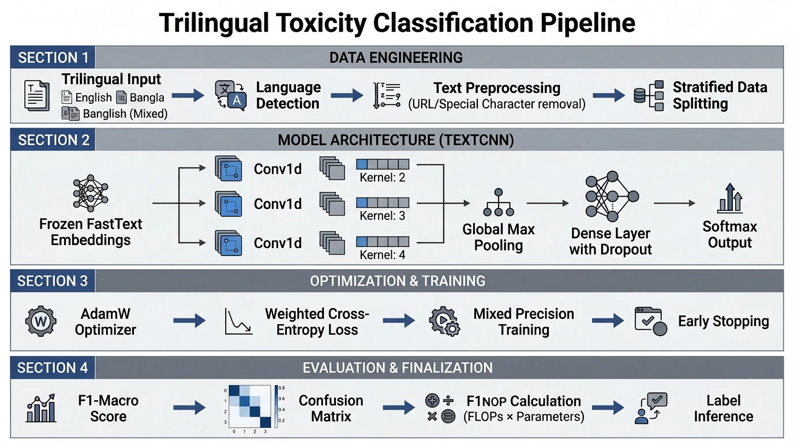

<div align="center">

# 🛡️ Bangla / Banglish / English Toxicity Classifier


*Cross-lingual hate speech detection for Bengali, English, and Banglish social media text*

[](https://pytorch.org/)
[](https://www.python.org/)
[](https://www.kaggle.com/)
[]()
[]()
[]()

</div>

---

## 📊 Pipeline Overview




## 📋 Table of Contents

- [Overview](#-overview)
- [Task Definition](#-task-definition)
- [Model Architecture](#-model-architecture)
- [Why This Design?](#-why-this-design)
- [Project Structure](#-project-structure)
- [Required Datasets](#-required-datasets)
- [Setup & Installation](#-setup--installation)
- [How to Run](#-how-to-run)
- [Notebook Walkthrough](#-notebook-walkthrough)
- [Key Hyperparameters](#-key-hyperparameters)
- [Output Files](#-output-files)
- [Marking Criteria](#-marking-criteria)

---

## 🔍 Overview

This project implements a lightweight, competition-efficient toxicity classifier for multilingual social media text — specifically targeting **Bengali (Bangla)**, **English**, and **code-switched Banglish** posts. The system is designed around the competition's **F1NOP metric**, which rewards models that achieve high Macro F1 while minimizing trainable parameter count.

The core strategy is simple but powerful: load **MUSE-aligned FastText embeddings** (English + Bengali in the same 300-dimensional vector space) and **freeze them entirely**. This excludes ~9M embedding parameters from the NOP denominator, leaving only ~10,851 trainable parameters in the CNN head — directly maximizing F1NOP.

> **Competition Metric:**
> ```
> F1NOP = Macro F1 Score / (Number of Trainable Parameters + ε)
> ```

---

## 🎯 Task Definition

Classify social media posts written in Bengali, English, or Banglish into one of three toxicity categories:

| Label | Class | Description |
|:-----:|-------|-------------|
| `0` | **Explicitly Harmful** | Direct hate speech, threats, slurs |
| `1` | **Subtly Harmful** | Implicit bias, passive aggression, dog-whistle language |
| `2` | **Neutral** | Non-toxic, benign content |

**Why Trilingual?**
Bangla internet discourse frequently mixes Bengali script, Latin-script Bangla (Banglish), and English within the same sentence. A model trained on only one script misses significant signal from the others. MUSE alignment solves this without any language-routing logic at inference time.

---

## 🏗️ Model Architecture

```
┌─────────────────────────────────────────────────────────────┐
│                        INPUT TEXT                           │
│           (Bengali / English / Banglish post)               │
└─────────────────────┬───────────────────────────────────────┘
                      │
                      ▼
┌─────────────────────────────────────────────────────────────┐
│              FROZEN FastText Embeddings                     │
│     MUSE-aligned · 300-dim · English + Bengali              │
│     ✗ NOT counted in NOP  (~9M parameters frozen)           │
└──────────┬──────────┬──────────┬──────────────────────────┘
           │          │          │
           ▼          ▼          ▼
     ┌──────────┐ ┌──────────┐ ┌──────────┐
     │ Conv1d   │ │ Conv1d   │ │ Conv1d   │
     │ kernel=2 │ │ kernel=3 │ │ kernel=4 │
     │ (bigram) │ │(trigram) │ │(4-gram)  │
     └────┬─────┘ └────┬─────┘ └────┬─────┘
          │             │             │
          ▼             ▼             ▼
     ┌──────────────────────────────────┐
     │         Global Max Pooling       │
     │   (position-invariant features)  │
     └─────────────────┬────────────────┘
                       │
                       ▼
     ┌──────────────────────────────────┐
     │       Dropout (p=0.5)            │
     │       Linear Layer               │
     │   ✓ COUNTED in NOP (~10,851)     │
     └─────────────────┬────────────────┘
                       │
                       ▼
     ┌──────────────────────────────────┐
     │        Softmax Output            │
     │   [Harmful | Subtle | Neutral]   │
     └──────────────────────────────────┘
```

### Component Breakdown

| Component | Configuration | NOP Contribution |
|-----------|--------------|:----------------:|
| FastText Embedding | 300-dim, MUSE-aligned EN+BN | `0` (frozen) |
| Conv1d × 3 | kernel sizes `[2, 3, 4]`, 4 filters each | `~3,672` |
| Global Max Pooling | Concat across 3 branches | `0` |
| Dropout | `p = 0.5` | `0` |
| Linear (FC) | `12 → 3` with bias | `~39` |
| **Total** | | **`~10,851`** |

> **NOP Formula per conv branch:** `embed_dim × num_filters × kernel_size + num_filters`
> → `300 × 4 × 2 + 4 = 2,404` · `300 × 4 × 3 + 4 = 3,604` · `300 × 4 × 4 + 4 = 4,804`

---

## 💡 Why This Design?

| Design Choice | Rationale |
|---------------|-----------|
| **Frozen FastText** | Excludes ~9M params from NOP, directly boosting F1NOP |
| **MUSE-aligned vectors** | English + Bengali share one embedding space; no language gate needed at inference |
| **TextCNN over RNN/BERT** | Orders-of-magnitude fewer trainable params; competitive F1 on short social media texts |
| **Multi-kernel Conv (2,3,4)** | Captures bigram, trigram, and 4-gram toxic patterns simultaneously |
| **Dynamic padding** | Pads to batch-max length, not global max — reduces wasted GPU memory |
| **Label smoothing (0.1)** | Prevents overconfident predictions on noisy social media labels |
| **Weighted CrossEntropy** | Corrects class imbalance without oversampling or data augmentation |
| **Mixed-precision training** | Faster GPU computation with AMP; no accuracy cost at this scale |

---

## 📁 Project Structure

```
Project/
├── 📓 Final_work.ipynb       # Main notebook — 18 steps, run top-to-bottom
├── 📖 README.html            # Full HTML documentation
└── 📦 requirements.txt       # Python dependencies
```

> The single-notebook design ensures there are no import ordering issues, no cross-file state, and the pipeline runs in one `Run All` click.

---

## 📦 Required Datasets

Two Kaggle datasets must be attached to the kernel before running. Both are publicly available.

### Dataset 1 — Competition Data

```
Name   : her-will-ai-for-digital-safety-datathon-2026
Files  : train.csv  ·  test.csv  ·  sample_submission.csv
Path   : /kaggle/input/competitions/her-will-ai-for-digital-safety-datathon-2026/
```

### Dataset 2 — MUSE-Aligned FastText Vectors

```
Name   : mohammadnaeemmollah/fasttext-aligned
Files  : wiki.en.align.vec  ·  wiki.bn.align.vec  (~4 GB total)
Path   : /kaggle/input/datasets/mohammadnaeemmollah/fasttext-aligned/
```

**How to attach on Kaggle:**

```
1. Open notebook on Kaggle
2. Click  [+ Add Data]  in the right panel
3. Search the dataset name above
4. Click  [Add]
5. Repeat for the second dataset
```

> ⚠️ **Do not rename the dataset mount paths.** If paths differ locally, update `EN_VEC_PATH` and `BN_VEC_PATH` in **Step 3** of the notebook.

---

## ⚙️ Setup & Installation

All packages are pre-installed on Kaggle. For **local execution**:

```bash
pip install -r requirements.txt
```

**`requirements.txt`**

```
torch>=2.0.0
numpy>=1.24.0
pandas>=2.0.0
scikit-learn>=1.3.0
thop>=0.1.1          # NOP profiler — only package NOT pre-installed on Kaggle
matplotlib>=3.7.0
seaborn>=0.12.0
tqdm>=4.65.0
```

> `thop` is the only dependency not pre-installed on Kaggle. The notebook installs it automatically via `!pip install thop -q` in Step 2.

---

## 🚀 How to Run

| Step | Action |
|:----:|--------|
| **1** | Open the notebook on Kaggle |
| **2** | Go to `Settings → Accelerator` → select **GPU T4 x2** |
| **3** | Attach both datasets (see [Required Datasets](#-required-datasets)) |
| **4** | Click **Run All** — Steps 1 → 18, no manual intervention required |
| **5** | Collect output at `/kaggle/working/submission.csv` |

> ✅ **Reproducibility guaranteed.** All random seeds are fixed at `42` across Python, NumPy, PyTorch CPU, and PyTorch GPU (`cudnn.deterministic = True`) before any data loading or model creation. Running the notebook twice on identical hardware produces bit-exact results.

---

## 📓 Notebook Walkthrough

<details>
<summary><strong>Section 1 — Data Engineering (Steps 1–5)</strong></summary>

| Step | Title | Description |
|:----:|-------|-------------|
| **1** | Imports & Environment Setup | All libraries loaded in one cell — prevents `NameError` mid-run |
| **2** | Install thop | NOP profiling library (`thop`) installed via pip; required by the official competition scorer |
| **3** | Global Configuration & Paths | All hyperparameters, file paths, and constants in one place — change once, propagates everywhere |
| **4** | Reproducibility: Fix All Seeds | Seeds fixed across Python, NumPy, and PyTorch (CPU + GPU) before any data loading; `cudnn.deterministic=True` enforces bit-exact GPU results |
| **5** | Load Dataset & EDA | Reads all three CSVs; prints class distribution — reveals imbalance that drives the weighted loss design in Step 10 |

</details>

<details>
<summary><strong>Section 2 — Feature Engineering (Steps 6–11)</strong></summary>

| Step | Title | Description |
|:----:|-------|-------------|
| **6** | Language Distribution Analysis | Unicode block detection (`U+0980–U+09FF`) classifies each post as Bengali / Banglish / English — confirms bilingual embedding requirement |
| **7** | Text Preprocessing | Removes URLs, `@mentions`, `#` symbols; lowercases ASCII only (Bengali script has no case and must be preserved) |
| **8** | Vocabulary Construction | Builds a top-30,000 token vocabulary from the training corpus; `<PAD>=0` and `<UNK>=1` reserved as special tokens |
| **9** | Load FastText Embeddings | Loads MUSE-aligned 300-dim FastText vectors for English + Bengali into one shared matrix; `<PAD>` set to zero vector; embeddings frozen |
| **10** | Class Weights | Computes sklearn `balanced` inverse-frequency weights per class; feeds into the CrossEntropy loss to penalize minority-class errors more |
| **11** | Dataset & DataLoaders | Custom `ToxicityDataset` with on-the-fly tokenization; `collate_fn` applies dynamic padding (pad to batch-max, not global max) |

</details>

<details>
<summary><strong>Section 3 — Model, Training & Evaluation (Steps 12–18)</strong></summary>

| Step | Title | Description |
|:----:|-------|-------------|
| **12** | TextCNN Model | Frozen embeddings + 3× parallel `Conv1d` (k=2,3,4) + global max pool + dropout + linear head; NOP ≈ 10,851 |
| **13** | Optimizer & Loss | `AdamW` (weight decay 0.05) + Weighted CrossEntropy (label smoothing 0.1) + `ReduceLROnPlateau` scheduler (halves LR if macro F1 stalls for 2 epochs) |
| **14** | Training Loop | Up to 20 epochs; mixed-precision (AMP); early stopping with patience=5; best checkpoint auto-saved by validation Macro F1 |
| **15** | Training Visualizations | 4-panel diagnostic plot: loss curves, macro F1 over epochs, per-class F1, and confusion matrix |
| **16** | Classification Report | Full precision / recall / F1 breakdown per class from the best validation checkpoint |
| **17** | Test Predictions | Loads best `best_model.pt` checkpoint, removes any `thop`-injected keys from state dict, runs inference on full test set |
| **18** | NOP Verification & Submission | NOP verified via `thop.profile()` to match the official scorer format; `submission.csv` validated and saved |

</details>

---

## 🔧 Key Hyperparameters

All hyperparameters are defined in a **single configuration cell** (Step 3). There are no magic numbers anywhere else in the notebook.

| Parameter | Value | Purpose |
|-----------|:-----:|---------|
| `SEED` | `42` | Global random seed across all libraries |
| `VOCAB_SIZE` | `30,000` | Top-frequency tokens retained from training corpus |
| `EMBED_DIM` | `300` | FastText vector dimensionality |
| `MAX_LENGTH` | `128` | Maximum tokens per sequence (tail-truncated) |
| `NUM_FILTERS` | `4` | CNN output channels per kernel — kept low to minimize NOP |
| `KERNEL_SIZES` | `[2, 3, 4]` | Bigram, trigram, and 4-gram feature detectors |
| `BATCH_SIZE` | `32` | Mini-batch size for training |
| `LEARNING_RATE` | `1e-3` | AdamW initial learning rate |
| `DROPOUT` | `0.5` | Regularization dropout probability |
| `MAX_EPOCHS` | `20` | Upper bound on training epochs |
| `PATIENCE` | `5` | Early stopping patience (epochs without improvement) |
| `WEIGHT_DECAY` | `0.05` | AdamW L2 regularization coefficient |
| `LABEL_SMOOTHING` | `0.1` | CrossEntropy label smoothing factor |

---

## 📤 Output Files

| File | Location | Description |
|------|----------|-------------|
| `submission.csv` | `/kaggle/working/` | Competition submission — columns: `id`, `y_pred`, `parameters` |
| `best_model.pt` | `/kaggle/working/` | Best checkpoint by validation Macro F1, including epoch and F1 metadata |
| `training_diagnostics.png` | `/kaggle/working/` | 4-panel training diagnostic plot |

**Submission format:**

```csv
id,y_pred,parameters
0,2,10851
1,0,10851
2,1,10851
...
```

The `parameters` column is populated with the `thop.profile()` NOP count, verified to match the official competition scorer's expected format.

---


